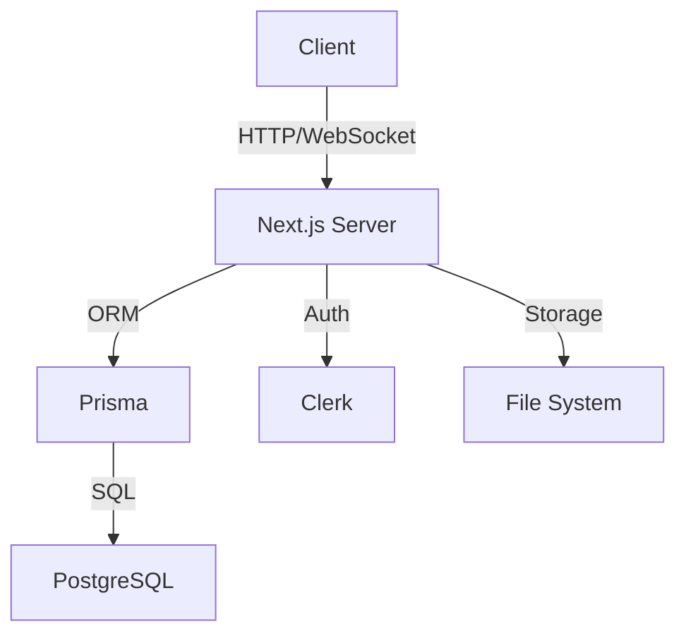

<!-- <div align="center"> -->

# FormLab


### Open Source Form Builder for the Modern Web

[](https://opensource.org/licenses/MIT)
[](https://nextjs.org)
[](https://www.prisma.io)
[](https://www.postgresql.org)
[](https://clerk.dev)

[Demo](https://formlab.dev) • [Documentation](https://docs.formlab.dev) • [Contributing](#contributing) • [Support](#support)

</div>

## 🚀 Quick Start

```bash
# Clone the repository
git clone https://github.com/vyasvishal/formlab.git

# Navigate to the project directory
cd formlab

# Install dependencies
npm install

# Set up environment variables
cp .env.example .env.local

# Start the development server
npm run dev
```

Visit `http://localhost:3000` to see FormLab in action!

## 🔑 Environment Variables

Create a `.env.local` file with the following variables:

```env
# Authentication
NEXT_PUBLIC_CLERK_PUBLISHABLE_KEY=your_clerk_publishable_key
CLERK_SECRET_KEY=your_clerk_secret_key

# Database
DATABASE_URL=your_postgresql_url

# Optional: Analytics
NEXT_PUBLIC_ANALYTICS_ID=your_analytics_id
```

## 🌟 Features

### Form Creation
- **Drag-and-Drop Builder** - Intuitive interface for building forms
- **Custom Fields** - Text, Multiple Choice, Checkboxes, Date, File Upload
- **Validation Rules** - Required fields, email format, number ranges
- **Responsive Design** - Forms look great on all devices

### Authentication & Security
- **Secure Login** - Powered by Clerk Auth
- **Role-Based Access** - Admin and User roles
- **Data Encryption** - End-to-end encryption for sensitive data
- **GDPR Compliant** - Built with privacy in mind

### Dashboard
- **Real-time Analytics** - Track form submissions
- **Export Options** - Download responses as CSV/Excel
- **Search & Filter** - Find submissions quickly
- **Visual Reports** - Charts and graphs for data analysis

### Sharing & Collaboration
- **Unique Links** - Share forms via unique URLs
- **Team Management** - Collaborate with team members
- **Access Control** - Set form visibility and permissions
- **Embed Support** - Add forms to any website

## 🛠️ Technology Stack

### Frontend
- **Next.js** - React framework for production
- **Tailwind CSS** - Utility-first CSS framework
- **shadcn/ui** - Accessible component system
- **Framer Motion** - Smooth animations

### Backend
- **Prisma** - Modern database toolkit
- **PostgreSQL** - Reliable database system
- **Clerk Auth** - Authentication and user management
- **API Routes** - Serverless API endpoints

## 📊 System Architecture



## 🚀 Getting Started

### Prerequisites
- Node.js 18+
- PostgreSQL database
- Clerk account

### Installation Steps

1. **Clone & Install**
   ```bash
   git clone https://github.com/vyasvishal/formlab.git
   cd formlab
   npm install
   ```

2. **Configure Environment**
   - Copy `.env.example` to `.env.local`
   - Add your Clerk and PostgreSQL credentials

3. **Database Setup**
   ```bash
   npx prisma migrate dev
   npx prisma generate
   ```

4. **Start Development**
   ```bash
   npm run dev
   ```

## 🤝 Contributing

We love contributions! Here's how you can help:

1. Fork the repository
2. Create your feature branch (`git checkout -b feature/AmazingFeature`)
3. Commit changes (`git commit -m 'Add AmazingFeature'`)
4. Push to branch (`git push origin feature/AmazingFeature`)
5. Open a Pull Request

## 📘 Documentation

Visit our [documentation site](https://docs.formlab.dev) for:
- Detailed API references
- Integration guides
- Best practices
- Video tutorials

## 🌟 Use Cases

### Educational Institutions
- Student Feedback Forms
- Event Registration
- Course Evaluations
- Research Surveys

### Organizations
- Contact Forms
- Feedback Collection
- Application Forms
- Data Collection

## ⭐ Why FormLab?

### Open Source & Free
- MIT licensed
- No hidden costs
- Self-hostable
- Community driven

### User-Centric Design
- Intuitive interface
- Mobile responsive
- Accessible (WCAG 2.1)
- Multi-language support

### Enterprise Ready
- Role-based access
- Audit logs
- Data encryption
- API access

## 🔒 Security

- End-to-end encryption
- GDPR compliance
- Regular security audits
- Data backups

## 🌐 About

FormLab is developed by Vyas Vishal under CodeLab, a student club at AMPICS. Our mission is to make form creation and data collection accessible to everyone.

## 📫 Support

- [GitHub Issues](https://github.com/vyasvishal/formlab/issues)
- [Discord Community](https://discord.gg/formlab)
- [Email Support](mailto:support@formlab.dev)

## 📄 License

FormLab is open-source software by vyas vishal.

---

<div align="center">
Made with ❤️ by <a href="https://github.com/vyasvishal">Vyas Vishal</a> and the CodeLab team
</div>
